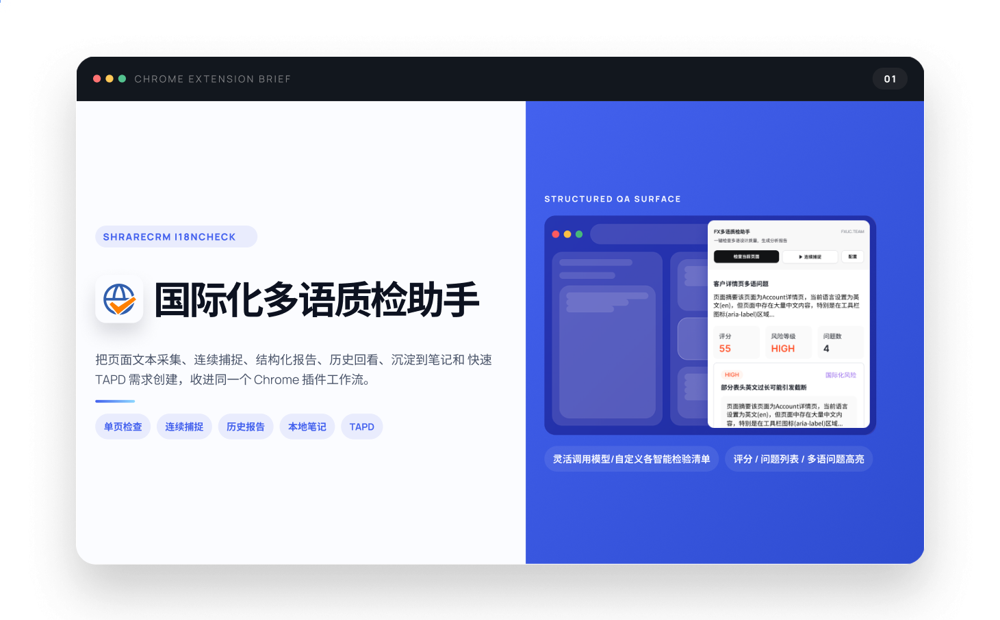

# Fxiaoke 多语质检助手


用于检查页面国际化多语质量的 Chrome 插件，支持单页检查、连续捕捉汇总、结构化质检报告、历史记录管理，并可将报告导出到 macOS 备忘录与本地 Markdown 归档，还可以一键发布到TAPD创建需求。


## 功能介绍


- 采集当前网页或本地 HTML 的标题、按钮、表头、字段标签、占位符等文本
- 调用模型生成结构化“多语质检报告”
- 支持连续捕捉用户点击路径，并输出跨页面/弹窗的汇总报告（避免模型超时限制点击12次/180秒）
- 在浏览器右侧边栏查看历史报告、详情、评分和问题列表
- 支持报告截图预览、页面问题高亮、连续捕捉步骤回看
- 支持内置自定义提示词模板和输出报告格式，已内置“通用”“设计体验”。
- 支持将报告导出到 Apple备忘录（可DIY导出到其它笔记），并同时归档为本地 Markdown 文件
- 支持一键创建TAPD（需和管理员获取到TAPD API，也可DIY改造自动其它项目wiki）

[![查看演示视频]](https://vimeo.com/1177679947?share=copy&fl=sv&fe=ci)

## 安装方法

### 1. 安装插件

1. 下载此项目文件，解压到本地目录。打开 Chrome ”扩展管理”或直接输入`chrome://extensions`
2. 打开右上角“开发者模式”，点击“加载已解压的扩展程序”
3. 选择当前仓库根目录，或者直接选择 `extension/` 目录
5. 如果需要检查本地 HTML，请在扩展详情页打开“允许访问文件网址”

### 2. 首次配置模型

插件首次使用需要配置引用模型和API。“模型厂商”下拉中提供常用厂商预设。

为了方便FXer拎包入住，已预置了默认卡片，点击编辑直接录入研发中心分发的API key即可。
申领说明（内部文档）：FXer模型调度指南 https://365.kdocs.cn/l/ceGtJnEJnOHv

已预置内容：
- `配置名称`: `FX共享`
- `模型名称`: `MiniMax-M2.5`
- `API Base URL`: `https://aihub.firstshare.cn`
- `API 格式`: `/v1/messages`
- `认证 Header`: `Authorization`
- `认证 Scheme`: `Bearer`

需要自行补充：

- `API Key`

如果不使用预设厂商请选择，或者其它来源，可选任一厂商，直接手动填写修改：

- `API Base URL`
- `API 格式`
- `API Key`
- `模型名称`

## 使用说明

1. 打开要检查的网页，或本地 HTML 文件，打开插件侧边栏
2. 根据场景选择：
   - 点击“检查当前页面”，执行单页检查
   - 点击“连续捕捉”，在当前窗口连续点击组件、跳页等操作，再次点击“捕捉中”结束操作，后生成汇总报告
5. 在报告生成后，自动打开报告卡片，查验问题列表，如不属于质检范围内的问题，可点“忽略”
6. 点击单个问题卡片，页面中的问题会高亮显示，也可在配置页打开“全部高亮”开关。（高亮功能仅支持单页，“连续捕捉”暂不支持）
7. 在报告页点击“导出到备忘录”，可将生成的报告自动存到本地MK，也可自动同步到Mac的“备忘录”（在备忘录自动新建的“Fxiaoke 多语质检”目录下），备忘录功能需配置Mac桥接。

## 配置与模板说明

### 提示词模板

- 在配置页中已内置模板：
  - `通用`
  - `设计体验`
- “单页”和“连续捕捉”需分别配置提示词
- 支持“另存模板”创建自己所在业务关联的多语规则模板

## Mac 备忘录桥接说明

### 适用环境

- macOS
- 已安装 Node.js
- 当前账号允许使用 Apple Notes

### 单次生效：手动启动 bridge

推荐直接运行仓库里提供的启动脚本：

在仓库根目录执行：

```bash
zsh scripts/start-apple-notes-bridge.sh
```

启动后，插件会把导出的报告发送到本机 `http://127.0.0.1:3894/note`，bridge 会完成两件事：

- 写入 Apple Notes 指定文件夹
- 在本地归档目录生成 `.md` 文件

### 永久：开机自动启动 bridge

在登录 macOS 后自动启动 bridge，可执行：

```bash
zsh scripts/install-apple-notes-bridge-launchagent.sh
```

这个脚本会自动：

- 读取当前仓库路径
- 读取当前机器上的 `node` 可执行文件路径
- 生成 `~/Library/LaunchAgents/com.multilingual-check.apple-notes-bridge.plist`
- 注册并启动对应的 `launchd` 服务


## TAPD 配置说明

如果你希望把检查结果直接转成 TAPD 需求，可额外填写：

- `TAPD API账号` 需向管理员申领
- `TAPD 创建人用户名` 本人TAPD用户名
- `TAPD Token` 需向管理员申领
- `TAPD 需求列表链接` 你创建需求所在的业务列表
